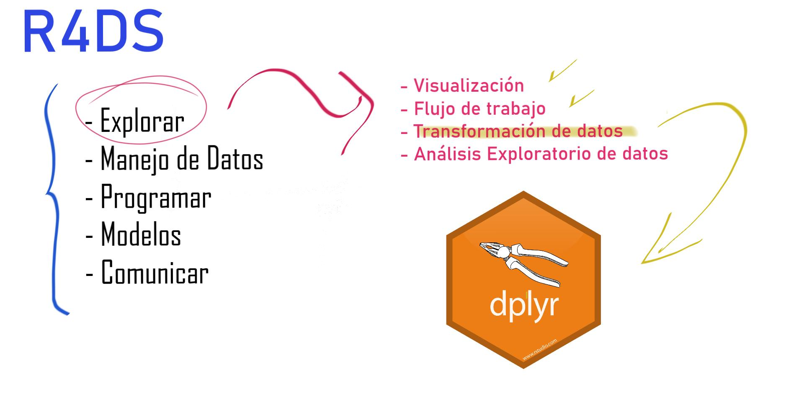
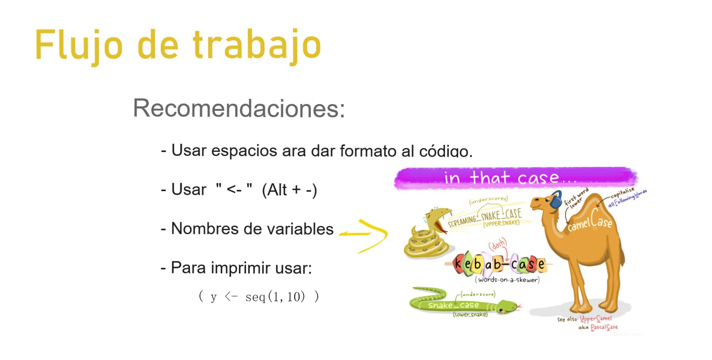
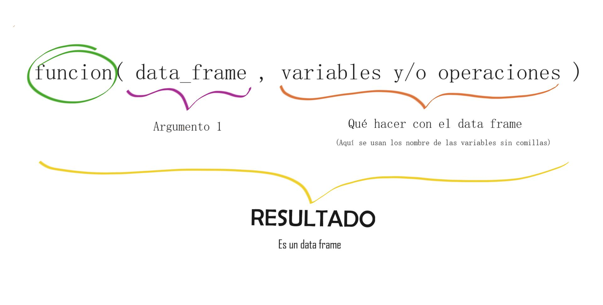

```{r setup, include=FALSE}
knitr::opts_chunk$set(echo = TRUE, message=FALSE, warning=FALSE)
```

### Donde estamos?



### Previamente (Cap 4):




### Motivación:

- Los datos no siempre están dispuestos de la forma que necesitamos (por ejemplo para hacer una visualización)

- Necesidad de crear variables, resúmenes, cambiar nombre de variables o reordenar.

### Librerías y datos:

```{r}
library(tidyverse)
library(datos)
```

**Dataset:** vuelos

### Paquete dplyr

En este capítulo se habla principalmente del uso de 6 funciones (asociadas a verbos) de este paquete. Las 5 primeras pueden usarse junto a la sexta.

1. `filter()`

2. `arrange()`

3. `select()`

4. `mutate()`

5. `summarise()`

6. `group_by()`

Estas funciones no modifican el input, es decir, hay que agregar a un objeto si queremos guardar el resultado.

Todas las funciones siguen una misma estructura:



1. `filter()` 
 
Selecciona filas que cumplen condiciones: `filter(data_frame, condiciones)`
 
**Importante:** 
 
 - Para las condiciones usamos: `> , >=, <, <=, != (diferente), == (igual)`
 
 - función `near()` más confiable que `==`.
 
 - Todas las condiones que se pongan (separadas por comas) se entienden como un &. Eso nos lleva a recordar los *operadores lógicos*.
     + & (y)
     + | (o)
     + ! (no)
     
 - También se ´puede usar   `%in%` para considerar varias valores de una variable.
     
 - Cuando realizamos un filtro se descartan los NA. (pero se puede agregar como una condición adicional)
 
 2. `arrange()`
 
 Nos sirva para ordenar (no selecciona sino que ordena): `arrange(data_frame, variable/s que se usa/n para ordenar)`
 
**Importante**:

- Ordena de forma ascendente, para descentende usar `desc()`.
- Los NA en la ordenación se colocan al final.

3. `select()`

Selecciona columnas (variables): `select(data_frame, variables a seleccionar(separadas por comas))`

**Importante**:

- Hay varias opciones adicionales que s epueden usar dentro de `select()`:

  + `var1:var2` (todas entre var1 y var2 incluyéndolas)
  + `-(var:var2)` todas excepto las que están entre var1 y var2 (incluyéndolas)
  + `start_with("abc")`
  + `ends_with("xyz")`
  + `contains("ijk")`
  + `matches ("(.)\\1")` variables con caracteres repetidos.
  + `num_range("x",1:3)` coincide con x1, x2, x3

- Si bien se puede usar para cambiar nombres de variables se uede usar `rename()`. Esta última no elimina las variables que no se nombran.

- Mover un grupo de variables al inicio con: `select(data_frame, varX, everything())` (pone a la varX en el inicio, la elimina de su posición original y luego coloca las demás).

4. `mutate()`

Agrega columnas (creadas) al final: `mutate(data_frame, var_ nueva = var1 / var2 )`

**Importante**:

- Se puede hacer referencia a variables recién creadas.
- Para guardar en un nuevo data frame SOLO las variables recien creadas se puede usar `transmute()`
- En `mutate()` se pueden usar: operadores aritméticos, aritmética modular, logaritmos, rezagos, agregados acumulativos, comparaciones lógicas, ordenamientos.

5. `summarise()`

Permite hacer resúmenes: `summarise(data_frame, promedioVar1 = mean(Var1, na.rm=TRUE))`

**Importante:**

Se puede aprovechar mejor si se usa con `group_by()`. 


6. `group_by()`

Esta función cambia la unidad de análisis de los datos completos a grupos individuales. Al aplicar los **verbos** dplyr éstos se aplicarán por grupos.

```{r}
por_dia <- group_by(vuelos, anio, mes, dia) #cambia unidad de análisis
summarise(por_dia, atraso = mean(atraso_salida, na.rm = TRUE)) #al aplicar summarise lo hace en cada grupo. 
```

### Ejercicios

```{r}
#Filter
filter(vuelos, mes == 1, dia == 1)
#Dos formas de hacer lo mismo:
filter(vuelos, mes == 11 | mes == 12) 
(nov_dic <- filter(vuelos, mes %in% c(11, 12)))

#NA
df <- tibble(x = c(1, NA, 3))
filter(df, x > 1)
filter(df, is.na(x) | x > 1)
```


```{r}
#Arrange
arrange(vuelos, anio, mes, dia)
arrange(vuelos, desc(atraso_salida))
```


```{r}
#Select
select(vuelos, anio, mes, dia)
select(vuelos, -(anio:dia))
rename(vuelos, cola_num = codigo_cola)
select(vuelos, fecha_hora, tiempo_vuelo, everything())
```


```{r}
#Mutate
vuelos_sml <- select(vuelos,
  anio:dia,
  starts_with("atraso"),
  distancia,
  tiempo_vuelo
)
mutate(vuelos_sml,
  ganancia = atraso_salida - atraso_llegada,
  velocidad = distancia / tiempo_vuelo * 60
)

#usar variables recien creada
mutate(vuelos_sml,
  ganancia = atraso_salida - atraso_llegada,
  horas = tiempo_vuelo / 60,
  ganacia_por_hora = ganancia / horas
)

#usar transmute
transmute(vuelos,
  ganancia = atraso_salida - atraso_llegada,
  horas = tiempo_vuelo / 60,
  ganancia_por_hora = ganancia / horas
)
```

```{r}
#Summarise
por_destino <- group_by(vuelos, destino)
atraso <- summarise(por_destino,
  conteo = n(),
  distancia = mean(distancia, na.rm = TRUE),
  atraso = mean(atraso_llegada, na.rm = TRUE)
)
atraso <- filter(atraso, conteo > 20, destino != "HNL")
ggplot(data = atraso, mapping = aes(x = distancia, y = atraso)) +
  geom_point(aes(size = conteo), alpha = 1/3) +
  geom_smooth(se = FALSE)
```

```{r}
#Uso del pipe %>%
atrasos <- vuelos %>%
  group_by(destino) %>%
  summarise(
    conteo = n(),
    distancia = mean(distancia, na.rm = TRUE),
    atraso = mean(atraso_llegada, na.rm = TRUE)
  ) %>%
  filter(conteo > 20, destino != "HNL") 
```

```{r}
# Uso del pipe + ggplot
vuelos %>%
  group_by(destino) %>%
  summarise(
    conteo = n(),
    distancia = mean(distancia, na.rm = TRUE),
    atraso = mean(atraso_llegada, na.rm = TRUE)
  ) %>%
  filter(conteo > 20, destino != "HNL") %>%
  ggplot(mapping = aes(x = distancia, y = atraso)) +
  geom_point(aes(size = conteo), alpha = 1 / 3) +
  geom_smooth(se = FALSE)
```

