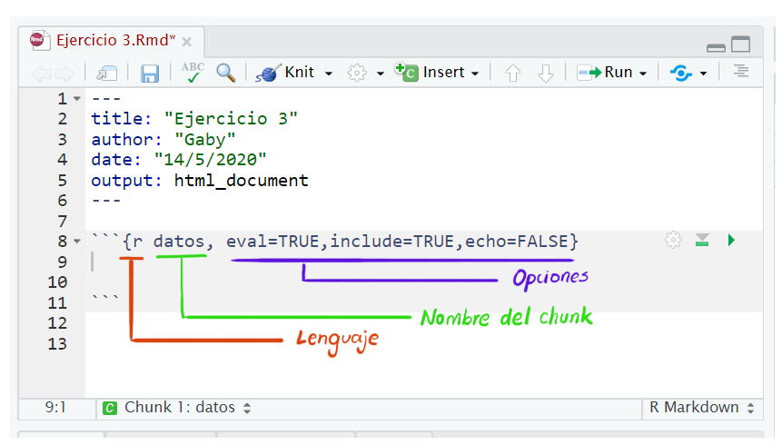
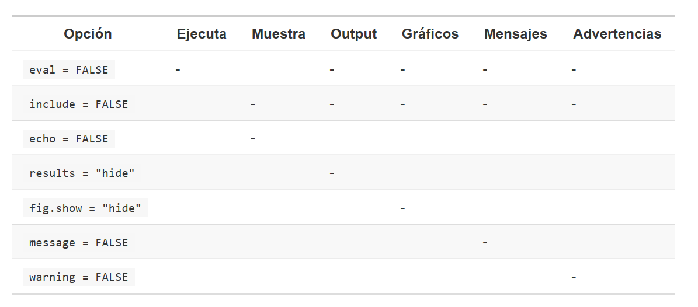

class: middle
```{r setup, include=FALSE}
knitr::opts_chunk$set(echo = TRUE, message=FALSE, warning=FALSE, fig.retina = 3)
library(icon)
```
```{css, echo= FALSE}
.silver{color: silver;}
.gray{color: darkgray;}
```

# Comunicar


---
background-image: url(imagenes/rm.jpg)
background-size: 70% 70%
background-position: 50% 50%

# ¿Por qué RMarkdown?
---
class: middle

# Cap 27
# ¿Qué es RMarkdown?

> Un marco de referencia para autoría de documentos para la ciencia de datos, combinando códigos, resultados y texto.

## .gray[De forma general se puede decir que:]

Un archivos de R Markdown se puede usar de tres formas:

1. **Comunicarse** con los tomadores de decisiones (interés en las conclusiones y no en el código).

2. **Colaborar** con otros científicos, incluyendo a tu "yo" del futuro (interés en código y conclusiones )

3. Un ambiente para hacer ciencia de datos como un **notebook** de laboratorio (capturar lo que hacemos y lo que estamos pensando cuando lo hacemos).

---
background-image: url(imagenes/rmd.png), url(imagenes/flujo.png)
background-size: 45%, 60%
background-position: 50% 25%, 50% 95%
# ¿Cómo funciona? 
Un archivo de RMarkdown es un archivo de texto plano con extensión `.Rmd`

<br>
<br>
<br>
<br>
## .gray[Flujo de trabajo]

<br>
<br>

---
# Estructura de un `.Rmd`

.right-column[

````
--- 
title: "Mi super titulo"
author: "Gaby"
date: "15/06/2020" 
output: html_document
--- 

## R Markdown

This is an R Markdown document. Markdown is a simple 
formatting syntax for authoring HTML, PDF, and 
MS Word documents...

You can embed an R code chunk like this:

```{r}`r ''`
summary(cars)
```

````

]
---
# Estructura de un `.Rmd`

.left-column[
<br>
<br>
<br>
**YAML**
]

.right-column[
````
--- 
*title: "Mi super titulo"
*author: "Gaby"
*date: "15/06/2020" 
*output: html_document
--- 

## R Markdown

This is an R Markdown document. Markdown is a simple 
formatting syntax for authoring HTML, PDF, and 
MS Word documents...

You can embed an R code chunk like this:

```{r}`r ''`
summary(cars)
```

````
]


---
# Estructura de un `.Rmd`

.left-column[
<br>
<br>
<br>
<br>
<br>
<br>
<br>
<br>
<br>
**TEXTO**
]

.right-column[
````
--- 
title: "Mi super titulo"
author: "Gaby"
date: "15/06/2020" 
output: html_document
--- 

*## R Markdown

*This is an R Markdown document. Markdown is a simple 
*formatting syntax for authoring HTML, PDF, and 
*MS Word documents...

*You can embed an R code chunk like this:

```{r}`r ''`
summary(cars)
```

````
]


---
# Estructura de un `.Rmd`

.left-column[
<br>
<br>
<br>
<br>
<br>
<br>
<br>
<br>
<br>
<br>
<br>
<br>
<br>
<br>
<br>
**CHUNK 
(CÓDIGO)**
]

.right-column[
````
--- 
title: "Mi super titulo"
author: "Gaby"
date: "15/06/2020" 
output: html_document
--- 

## R Markdown

This is an R Markdown document. Markdown is a simple 
formatting syntax for authoring HTML, PDF, and 
MS Word documents...

You can embed an R code chunk like this:

*```{r}`r ''`
*summary(cars)
*```

````
]

---
# Texto

El texto en los `.Rmd` está escrito en Markdown, colección de *convenciones* para dar formato a archivos de texto plano.   

[Algunos ejemplos en la cheatsheet de RMarkdown](https://rstudio.com/wp-content/uploads/2016/03/rmarkdown-cheatsheet-2.0.pdf)

[RMarkdown:The Definitive Guide](https://bookdown.org/yihui/rmarkdown/markdown-syntax.html)
---
# Chunk o bloque de código

Para ejecutar código en un documento `Rmd` necesitamos insertar un **chunk**:
+ Podemos usar `Ctrl + Alt + I`.
+ También podemos usar el botón de insertar.
+ O escribir manualmente las tres comillas.


---
### .gray[Opciones del chunk]
La siguiente tabla muestra lo que se omite con cada opción.
.center[

]

---
### Tablas

Por defecto, R Markdown imprime data frames y matrices tal como se ven en la consola:

```{r}
mtcars[1:5, ]
```

---
Le podemos dar un formato adicional con `knitr::kable`

```{r eval=FALSE}
knitr::kable(
  mtcars[1:5, ],
  caption = "Un kable de knitr."
)
```

```{r echo=FALSE}
knitr::kable(
  mtcars[1:5, ],
  caption = "Un kable de knitr.",format = "html"
)
```

---
### Sobre los nombres de los chunks:

* Los nombres en el chunck son opcionales pero pueden ser útiles para: 
  + Navegar más fácil en el archivo.
  + "re usar" un bloque de código que genera un gráfico.
  + crear redes de bloques para no re-ejecutar código.
  
* Hay un chunk especial `setup`.

Nota: No pueden repetirse los nombres.

Recomendación: nombrar un chuck según el objeto que creamos en él.

---
### Caching
Si en el código hacemos cálculos que toman mucho tiempo y no queremos que se realicen cada vez que renderizamos el documento, la solución es `cache=TRUE`.

**Idea:** 
En corridas subsecuentes, `knitr` revisara si el código ha cambiado y si no ha cambiado, reutilizará los resultados del cache. 

Nota: cuidado porque se basa en el código y no en sus **dependencias.**

Para resolver el problema de las dependencias esta la opción: `dependson = NombreDelChunkDelQueDependeElCached`. (también puede ser un vector de nombres)

Si una dependecia es un chunk en el que se lee un archivo también podemos "hacer caching" a ese archivo (seguir sus modificaciones) con `cache.extra = file.info("nombrearchivo.csv")`

**¿Mucho cache?**

Usar regularmente: `knitr::clean_cache()` 

---
### Opciones globales

Predeterminar algunas opciones para todo el documento. Poe ejemplo si estamos preparando un reporte puede ser útil:

```{r eval=FALSE}
knitr::opts_chunk$set(
  echo = FALSE
)
```

### Código en linea

El texto:
````
En el data set iris tenemos información de  `r ''` `r `r ''` nrow(iris)`  flores.

````

Se convierte en:

En el data set iris tenemos información de `r nrow(iris)` flores.

---

**Tip:**

Cuando insertamos números en el texto es útil la función `format()`

```{r}
comma <- function(x) format(x, digits = 2, big.mark = ",")
```

Por ejemplo:

```{r}
comma(3452345)
comma(.12358124331)
```

---
#YAML

* Contiene la metadata del documento.
* Permite controlar configuraciones del documento completo.
* RMarkdown lo usa para controlar detalles del output (El cap 27 discute 2: parámetros y bibliografías)

### Parámetros:
Valores que se fijan cuando se renderiza el documento:

* Reportes separados: examen por alumno, ventas por rama, etc. Para declarar el parámetro se usa `params`.

---
## ¿Errores?

* Reiniciar sesión y correr todos los chunks.
* Atención con el directorio de trabajo:
  El directorio de trabajo de un chuck es el directorio donde se encuentra el
  .Rmd
* Pensar en todo lo que puede causar un error.

---
# Cap 29
# Formatos en RMarkdown

Dos formas de definir el formato de salida de un .Rmd:

1. En el YAML

```{r eval=FALSE}
title: "Demo Viridis"
output: html_document
```

2. Llamando `rmarkdown::render()`

```{r eval=FALSE}
rmarkdown::render("diamond-sizes.Rmd", output_format = "word_document")
```


Nota: cada formato de salida está asociado a una función de R. Por lo tanto, es posible usar `?rmarkdown::formato` para consultar que opciones podemos modificar.

---
Para cambiar los parámetros predeterminados necesitamos usar un campo de **output extendido** (cascada):

```{r eval=FALSE}
output:
  html_document:
    toc: true
    toc_float: true
```


```{r eval=FALSE}
output:
  html_document:
    toc: true
    toc_float: true
  pdf_document: default
```

Sobre los diferentes formatos [VER](https://es.r4ds.hadley.nz/formatos-de-r-markdown.html) 


---

### Notebooks
* Variación de un html, enfocado en trabajo colaborativo, el notebook contiene el código fuente completo. Nos da una vista previa local.

* Aunque es fácil enviarlos por correo, se dificulta modificarlos en este caso una opción son los `github document`.

**Recomendación:**

```{r eval=FALSE}
output:
  html_notebook: default
  github_document: default
```

---
### Presentaciones

Las Presentaciones funcionan dividiendo tu contenido en diapositivas, con una nueva diapositiva que comienza en cada encabezado de primer nivel (`#`) o de segundo nivel (`##`). También puedes insertar una regla horizontal (`***`).

### Dashboards
- Tableros de control en español) son una forma útil de comunicar grandes cantidades de información de forma visual y rápida. 

- Requiere que isntalemos el paquete `flexdashboard`.

- Flexdashboard hace que sea particularmente fácil crear dashboards usando RMarkdown.

Cada encabezado de Nivel 1 (#) comienza una nueva página en el dashboard.

Cada encabezado de Nivel 2 (##) comienza una nueva columna.

Cada encabezado de Nivel 3 (###) comienza una nueva fila.

---
###Interactividad
Cualquier formato HTML (documento, notebook, presentación, o dashboard) puede contener componentes interactivos.

* htmlwidgets
HTML es un formato interactivo, y puedes aprovechar esa interactividad con htmlwidgets, funciones de R que producen visualizaciones HTML interactivas.

### shiny
Es un paquete que te permite crear interactividad usando código R, no JavaScript.

En el YAML se agrega: `runtime: shiny`.

```{r eval=FALSE}
title: "Applicación Web Shiny"
output: html_document
runtime: shiny
```

### Otras herramientas: sitios web, bookdown, prettydoc, rticles.

---
#Referencias:

* Ilustraciones por Allison Horst.

* Contenido: Cap 27 y 29 de R para Ciencia de datos.